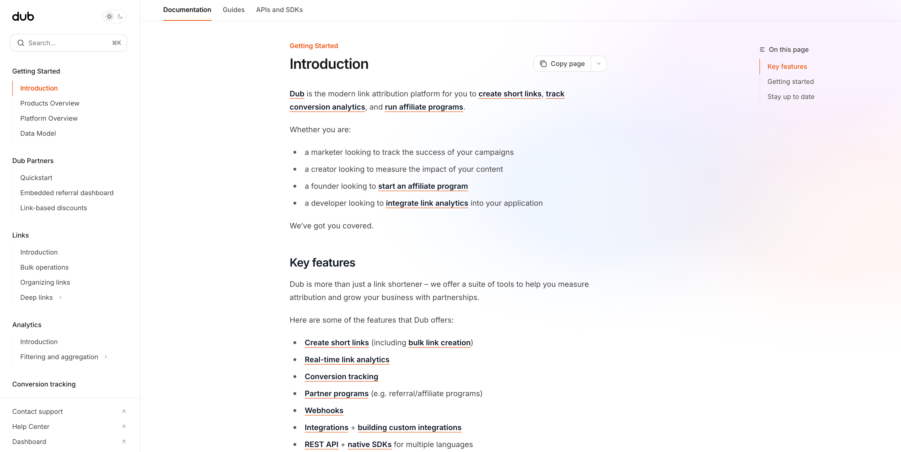

<a href="https://dub.co">
  
</a>

<h3 align="center">dubinc/docs</h3>

<p align="center">
    Official documentation for <a href="https://dub.co"><strong>Dub</strong></a>
</p>

## Getting started

1. Install Mintlify

```
npm i -g mintlify
```

2. In the root of the repository, run the following command:

```
pnpm run dev
```
